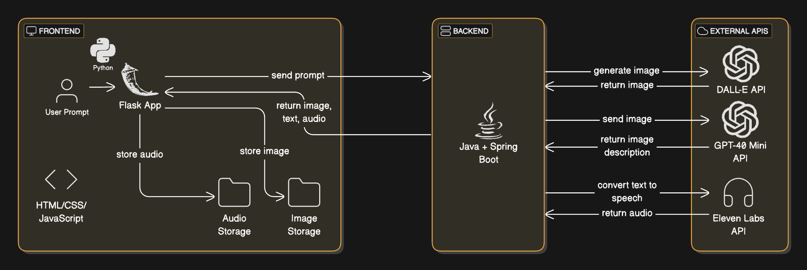

# AI-Powered Virtual Museum of Lost Worlds

## Description
VirtualMuseum is an innovative platform that brings extinct civilizations and fictional worlds to life. Visitors can explore dynamic exhibits featuring narrated tours, visual reconstructions, and interactive elements. Powered by AI technologies, including large language models (LLMs), image generation, and text-to-speech (TTS), it offers a truly immersive experience.

---

## Key Features
- **Dynamic Exhibit Creation**: Users can input prompts to generate unique exhibits based on their imagination.
- **AI-Generated Media**: Five AI-generated images are created for each prompt with text descriptions.
- **Narrated Tours**: High-quality audio narrations accompany exhibits for an immersive experience.
- **User-Friendly Interface**: A seamless frontend built with Python Flask, HTML, CSS, and JavaScript.
- **Robust Backend**: A Spring Boot backend handles API requests and data management.

---

## Architecture
The architecture of VirtualMuseum consists of three main components:

1. **Frontend**: Built with Flask for routing, displaying images, audio, and text.
2. **Backend**: Powered by Java and Spring Boot for efficient processing and API handling.
3. **External APIs**: 
   - **DALL-E** for image generation
   - **GPT-4.0 Mini** for detailed descriptions
   - **ElevenLabs** for text-to-speech narrations

---

## System Diagram
Below is the architecture diagram that illustrates the relationship between the components of VirtualMuseum.



---

## Getting Started

### Prerequisites
Before you begin, ensure you have the following installed:

- Python 3.8+
- Java 23+
- Flask
- Gradle
- API keys for DALL-E, GPT-4.0 Mini, and ElevenLabs

### Installation & Setup
To simplify the setup process, you can use the provided shell script, which will automatically clone the repository, set up the environment, and run both the backend and frontend.

1. Clone the repository:
   ```bash
   git clone https://github.com/mbirnhak/VirtualMuseum.git
   cd VirtualMuseum
   ```
2. Run the setup script to start the application:
   ```bash
   ./setup.sh
   ```
3. View the running application at:
   ```bash
   http://localhost:8080
   ```